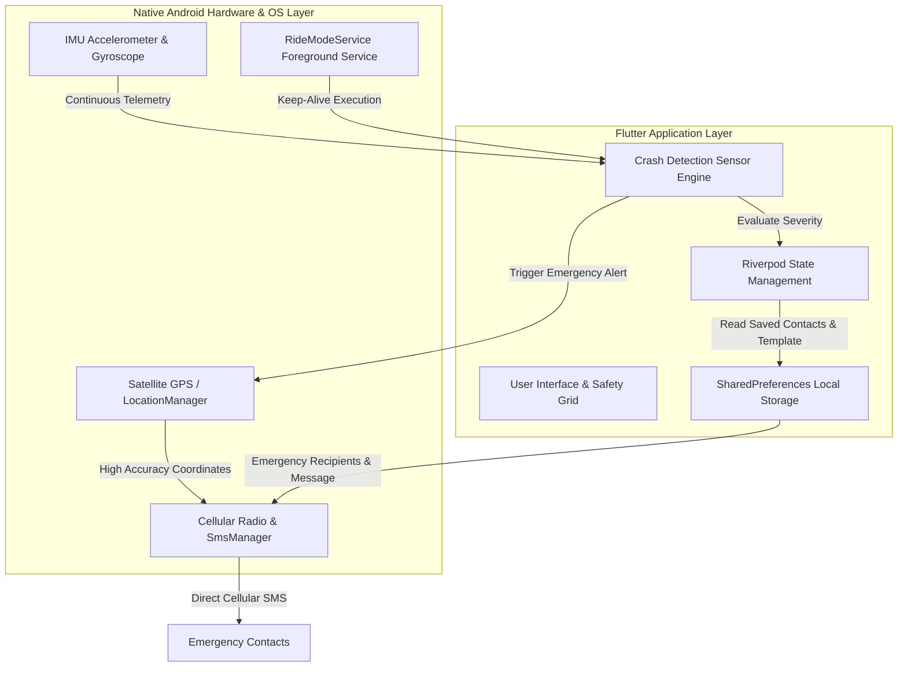

# Roadsos+ 🛡️
**Standalone AI-Powered Accident Detection & Automatic Emergency Response Platform**

[](https://flutter.dev)
[](https://dart.dev)
[](https://developer.android.com)
[](#architecture)
[](LICENSE)

---

## 📌 Executive Summary

**Roadsos+** is an advanced, standalone, offline-first mobile emergency assistance and safety platform. Designed to protect vehicle drivers and riders in real-time, Roadsos+ continuously monitors vehicular telemetry through on-device Inertial Measurement Unit (IMU) sensors (accelerometer and gyroscope) to detect potential vehicular accidents.

Upon detecting a severe collision, Roadsos+ automatically acquires high-accuracy offline satellite GPS coordinates and dispatches cellular SMS emergency text alerts with clickable Google Maps location links directly to saved emergency recipients via native Android `SmsManager` APIs—operating 100% independently of mobile data, cloud servers, or internet connectivity.

---

## 🌟 Key Features

* 🏍️ **Crash Detection & Ride Mode**: Continuous background IMU sensor telemetry processing (acceleration G-force & rotational velocity) paired with a background Android Foreground Service (`RideModeService.kt`).
* 📱 **Automatic Cellular SMS SOS**: Dispatches direct cellular SMS alerts to multiple emergency contacts via native `SmsManager` without requiring active mobile data or Wi-Fi.
* 📍 **Accurate Offline GPS Location Sharing**: High-accuracy satellite GPS coordinate resolution (`LocationService`) with dynamic Google Maps URL generation (`https://maps.google.com/?q=lat,lng`).
* 👤 **Local Driver Profile**: 100% on-device driver identity & safety preferences saved via `SharedPreferences`.
* 🧪 **Central Simulation Matrix**: Interactive test center to simulate crash G-forces, rotation speeds, and countdown timers without physical vehicular collisions.

---

## 🏗️ Architecture Overview

Roadsos+ operates on a completely decoupled, standalone local architecture. All data processing, sensor sampling, decision matrix calculations, location resolution, and notification dispatches occur locally on the user's mobile device.



### Key Architectural Pillars
1. **Zero Trust Cloud Infrastructure**: Operates independently of external API servers or cloud databases to guarantee maximum reliability during network infrastructure failures.
2. **Foreground Ride Mode Service**: Utilizes a native Android Foreground Service (`RideModeService.kt`) to prevent OS process termination during background operation or screen lock.
3. **Dual MethodChannel Interface**:
   - `com.roadsos.mobile/native`: Controls native foreground services, vibration feedback, and hardware GPS polling.
   - `automatic_sms/sms`: Communicates directly with Android's native `SmsManager` for cellular SMS dispatches.

---

## 🧮 Crash Detection Mathematical Severity Model

The crash evaluation algorithm calculates a multi-parametric **Severity Score** ($S \in [0.0, 1.0]$) using the following weighted mathematical model:

$$S = w_1 \cdot \min\left(1.0, \frac{G_{\text{peak}}}{G_{\text{threshold}}}\right) + w_2 \cdot \min\left(1.0, \frac{\Omega_{\text{peak}}}{\Omega_{\text{threshold}}}\right) + w_3 \cdot \frac{\Delta V}{V_{\text{pre}}} + w_4 \cdot f(T_{\text{inactivity}})$$

Where:
* $G_{\text{peak}} = \sqrt{G_x^2 + G_y^2 + G_z^2}$ represents total instantaneous impact vector magnitude (in $G$'s).
* $\Omega_{\text{peak}} = \sqrt{\omega_x^2 + \omega_y^2 + \omega_z^2}$ represents total angular velocity (in rad/s).
* $\Delta V$ represents sudden pre-impact speed differential (km/h).
* $T_{\text{inactivity}}$ represents post-impact driver immobility time (seconds).
* $w_1 = 0.40, w_2 = 0.30, w_3 = 0.15, w_4 = 0.15$ are empirical weighting coefficients ($\sum w_i = 1.0$).

### Impact Classification Matrix

| Severity Level | Score Range ($S$) | Response Logic |
| :--- | :--- | :--- |
| **LOW** | $S < 0.35$ | Minor bump / hard braking. Soft toast notification. No SOS triggered. |
| **MEDIUM** | $0.35 \le S < 0.70$ | Moderate bump / skid. Displays 60s countdown check dialog with alarm. Auto-triggers SOS if unhandled. |
| **HIGH / CRITICAL** | $S \ge 0.70$ | Severe collision / rollover. **Immediate automated SMS dispatch** + GPS location sharing. |

---

## 📁 Repository Structure

```
RoadSoS/
├── mobile_app/                         # Main Flutter Application Root
│   ├── android/                        # Native Android Kotlin Layer
│   │   └── app/src/main/kotlin/.../
│   │       ├── MainActivity.kt         # Native MethodChannel & SmsManager Integration
│   │       └── RideModeService.kt      # Native Background Foreground Service
│   ├── lib/
│   │   ├── core/
│   │   │   ├── constants/              # App Constants & Theme Definitions
│   │   │   ├── services/               # Crash Detection Engine & Location Service
│   │   │   └── theme/                  # Dark Emergency Theme Configuration
│   │   └── features/
│   │       ├── auth/                   # Local Authentication & Profile Management
│   │       ├── automatic_sms/          # Emergency Contacts & Message Editor Screen
│   │       └── crash_detection/        # Ride Mode UI & Simulation Center Modal
│   └── pubspec.yaml                    # Flutter Dependencies
└── README.md                           # Project Documentation
```

---

## 🚀 Getting Started

### Prerequisites

1. **Flutter SDK**: Installed Flutter version `3.41.5` or compatible (Dart `3.11.3`).
2. **Android SDK**: Android API Level 24+ (Android 7.0 Nougat or higher).
3. **Physical Android Device**: A physical device with an active SIM card and GPS capabilities (recommended for testing SMS dispatches and sensor metrics).

### Installation & Execution

1. **Clone the Repository**:
   ```bash
   git clone https://github.com/KishoreG2006/RoadSoS.git
   cd RoadSoS/mobile_app
   ```

2. **Install Flutter Dependencies**:
   ```bash
   flutter pub get
   ```

3. **Run Application on Connected Android Device**:
   ```bash
   flutter run
   ```

4. **Build Release APK**:
   ```bash
   flutter build apk --release
   ```
   *The release binary will be generated at `build/app/outputs/flutter-apk/app-release.apk`.*

---

## 🔑 Permissions Required

Roadsos+ requires the following permissions declared in `AndroidManifest.xml`:

```xml
<uses-permission android:name="android.permission.SEND_SMS" />
<uses-permission android:name="android.permission.ACCESS_FINE_LOCATION" />
<uses-permission android:name="android.permission.ACCESS_COARSE_LOCATION" />
<uses-permission android:name="android.permission.FOREGROUND_SERVICE" />
<uses-permission android:name="android.permission.VIBRATE" />
```

---

## 👨‍💻 Developer & Author

* **Author**: Kishore G ([@KishoreG2006](https://github.com/KishoreG2006))
* **Repository**: [https://github.com/KishoreG2006/RoadSoS](https://github.com/KishoreG2006/RoadSoS)

---

## 📄 License

This project is licensed under the **MIT License** - see the [LICENSE](LICENSE) file for details.
